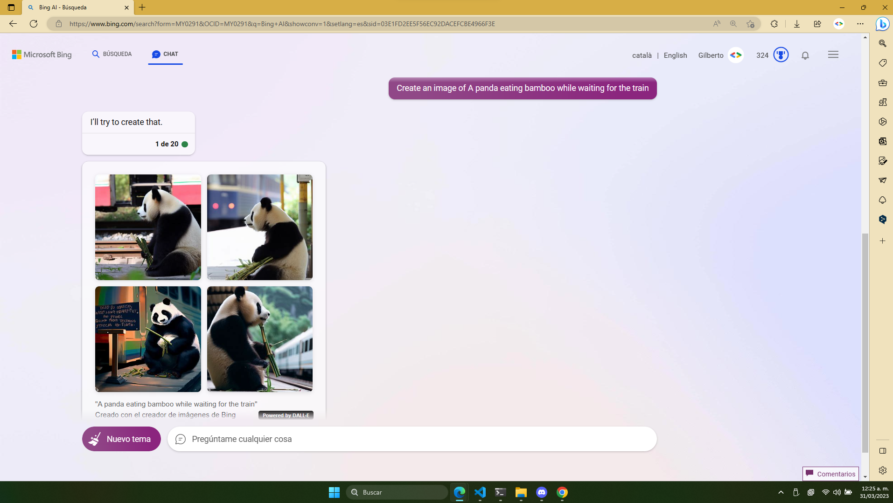
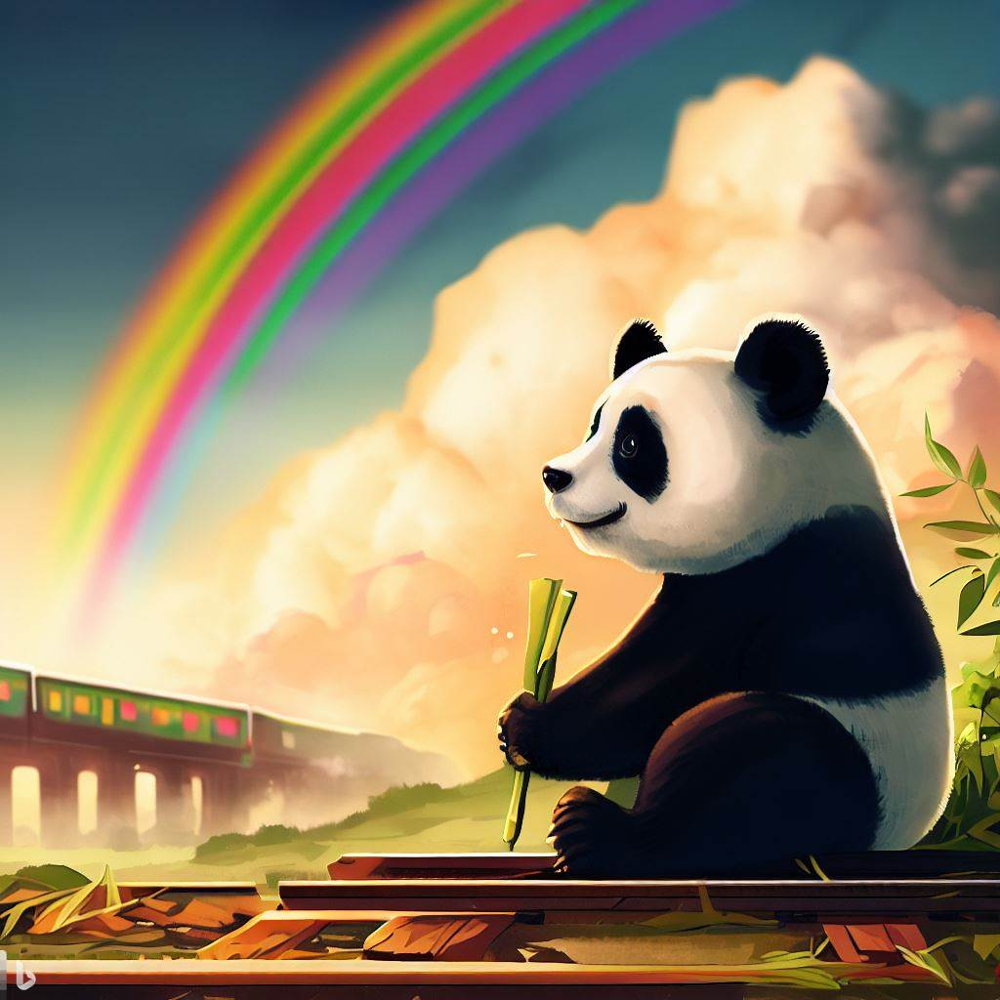
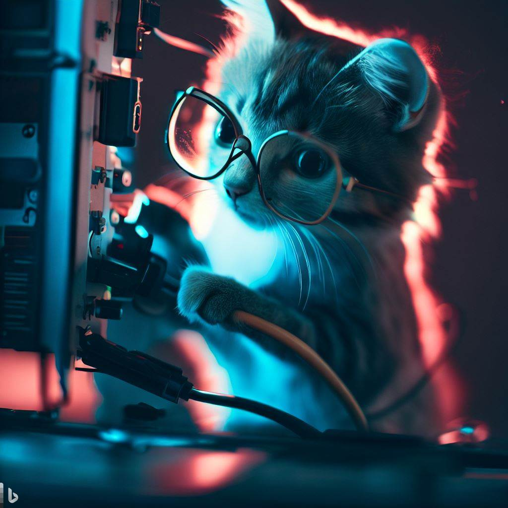
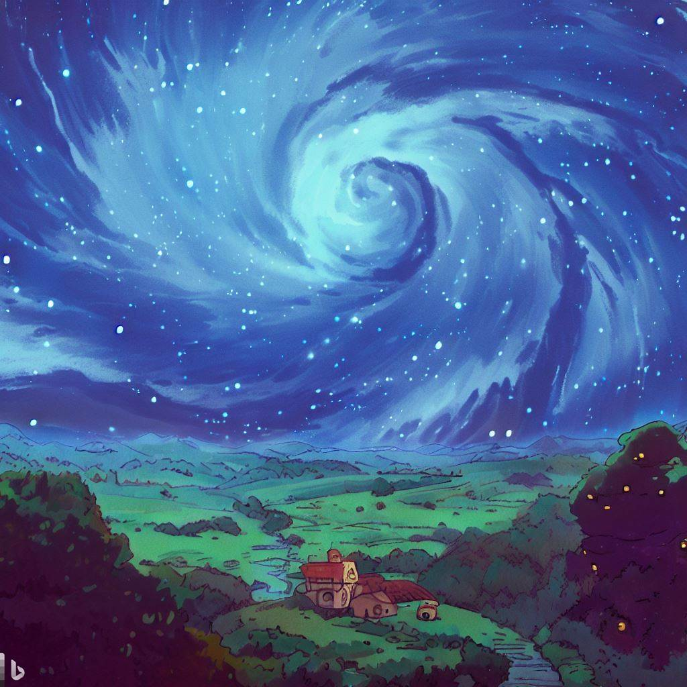
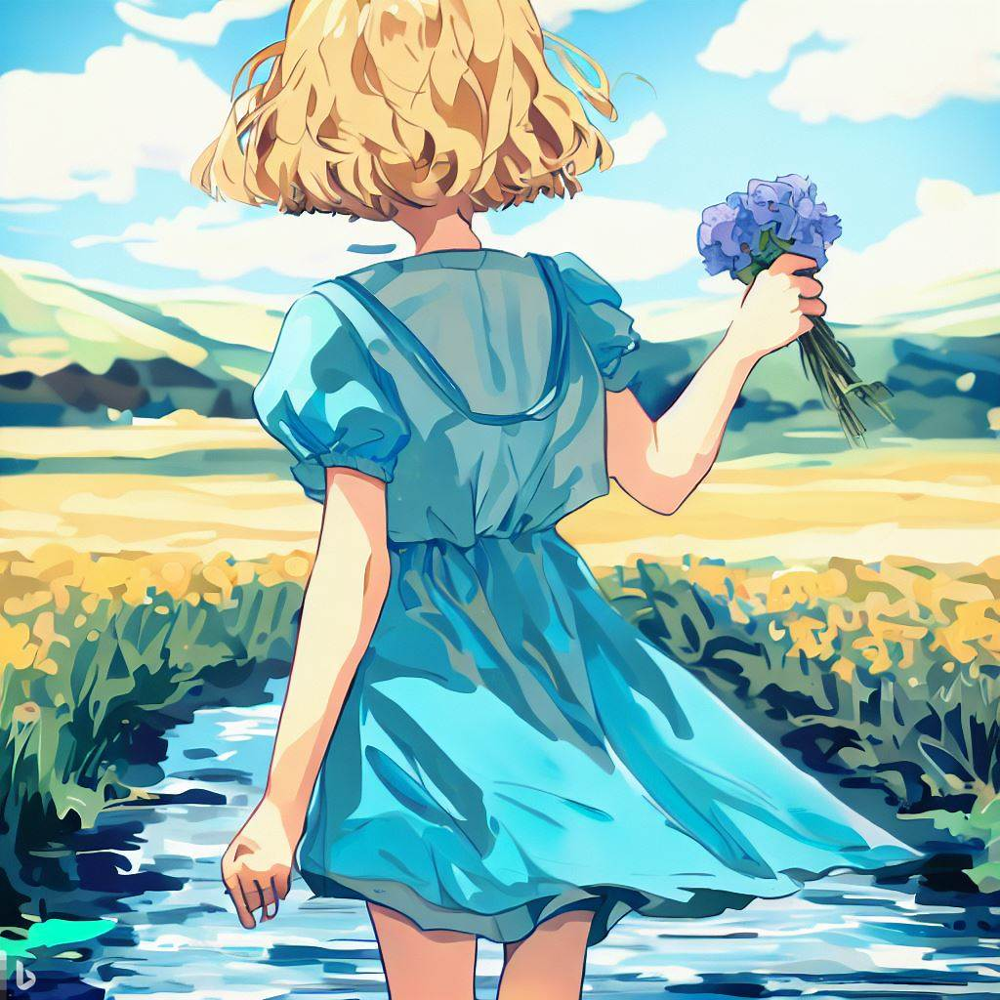
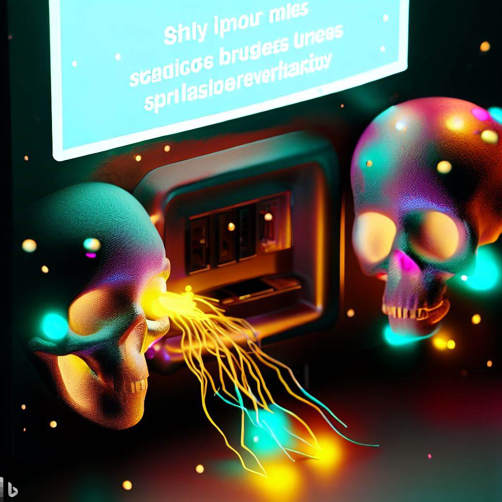
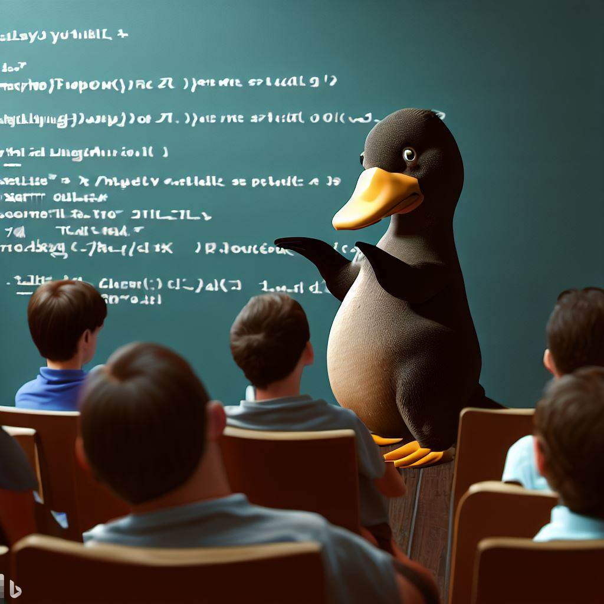

# Bing-chat-img
Test de git para uso de ramas
En este repositorio se muestra una galeria de imagenes generadas con Bing Chat Image, que permite crear imagenes con texto en el estilo de los chats de bing.

### Documentacion del uso de ramas y el pull request
[Explicacion del repositorio en Notion](https://gilbertscript.notion.site/Ramas-y-Conflictos-548fcd5b9b0a4f1180fa5297248135ac)

[Video Demostracion](https://drive.google.com/file/d/1E3yC7P6aBlwFqRQLL4TCpYptgVblg_TH/view?usp=share_link)

## Generacion de imagenes
Se debe tener acceso a la beta de Bing Chat Image, para ello se debe seguir los siguientes pasos:

1. Ingresar a la pagina de [Bing Chat Image](https://www.bing.com/new)
2. Unirse a la lista de espera
3. Realizar cualquier busqueda en Bing para acceder al nuevo apartado de Chat
4. En el chat, pasar al modo **Más creativo** y escribir en ingles (por el momento) la imagen que se desea generar.
5. Una vez generada la imagen, se puede descargar desde el chat.

Imagen de referencia cuando ya se tiene acceso a la beta de Bing Chat

## Galeria

Prompts | Imagen
---|---
A panda eating bamboo while waiting for the train with a rainbow in the background | 
a cat fixing a computer wearing glasses | 
a far off galaxy in studio ghibli style | 
Anime girl walking on a river, van gogh style with some flowers | 
a gray computer with fluorescent details launching viruses that look like skulls from an ethernet port with some sparks | 
a pair of programmers creating a port of the mythic doom with some scary demons in the background and realistic persons | 
a platypus giving a programming lecture with some students in the audience | 
random person playing chess versus the supercomputer deep blue | 
